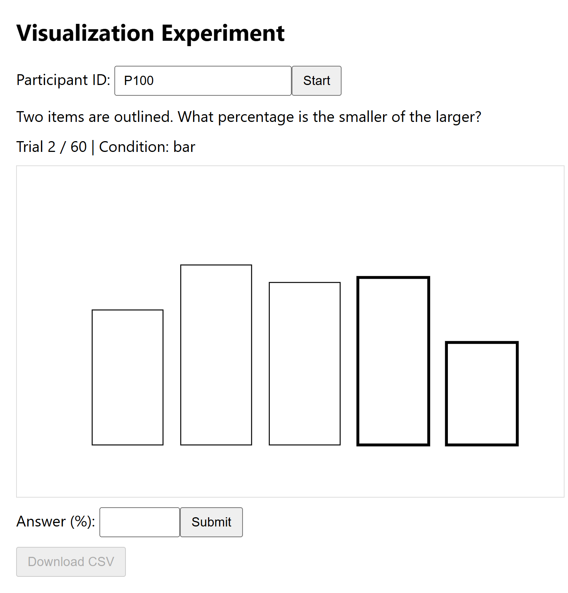
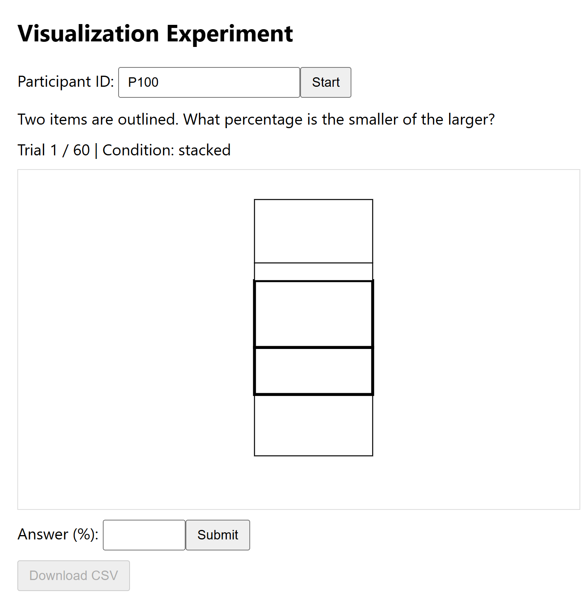
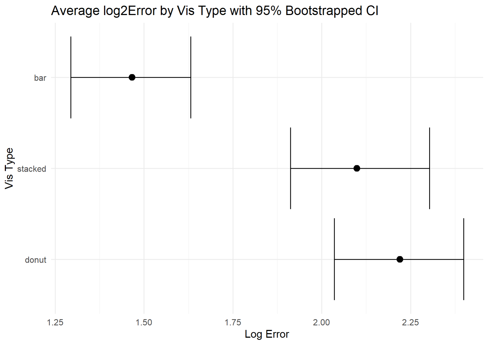

# Assignment 3 - Replicating a Classic Experiment  
Authors: Aditya Patel, Karinne Aiello, Victor Radina
Find the experiment hosted on GitHub Pages [here](https://adityaapatel.github.io/a3-experiment/).

## Experiment Overview
The type of visualization chosen to convey data can have a significant affect on the accuracy of viewers' perceptions. Our team wanted to investigate the idea that stacked bar charts are poor illustrations of information when compared to other charts. To do so, we developed a survey that showed each participant 20 stacked bar, 20 bar, and 20 donut charts and recorded their precision when answering "What percentage is the smaller value of the larger value?" between two shapes marked with bold outline. Each of our ten surveyees viewed their 60 trials with 2 data points marked out of 5 random generations, in random order, and having possible answers between 0% and 100%. When documenting respondents' accuracies between the the true percentage and their reported percentage, we used Cleveland and McGill's equation $\log_2(|judged percent - true percent| + 0.125)$ to avoid the bias that would arise from using `abs(ReportedPercent – TruePercent)` as the score for error. 

## Vises
To rank the three chosen visualization types from best to worst performance, we calculated and reported the average log2Error for each visualization across all trials and participants. See this information in the table below and an example of each visualization type from our survey.

| Visualization Type  | Average Error | Example  |
| ------------- | ------------- | ------------- |
| Bar  | 1.4663  |   |
| Stacked Bar  | 2.0992  |   |
| Donut  | 2.2203  |   |

> [!IMPORTANT]
> Given the above collected data from 200 trials for each visualization type, a **bar chart** is a far better illustrator than a stacked bar or donut chart.

## Intervals
In order to visualize the range of error for the visualizations, we constructed bootstrapped 95% confidence intervals for the error upper and lower bounds--visualized below. 



Our results compare quite well to those from other trials. The bar chart's average error of 1.4663 is within 0.2 of the T1 means from Cleveland & McGill's Results and Crowdsourced Results. The stacked bar chart's average error of 2.0992 is quite far from Cleveland & McGill's Results with an average of 2.75, but it is within 0.2 of the T5 mean from Crowdsourced Results. While neither figure reports a mean for a donut chart, the Crowdsourced Results include a pie chart, which is the most similar. The donut chart's average of 2.2203 appears to be identical to that of T6 from Crowdsourced Results.


## Achievements
### Technical 
- [x] Built a trial tracker (e.g. "Trial 29/60") into the survey, allowing participants to monitor their progress to reduce dropouts--as 60 trials is not short
- [x] Implemented functionality across a wide variety of languages, including HTML, CSS, JavaScript, R, and Python, demonstrating depth and versatility in coding
- [x] Outlined the code to be modular and easy to maintain and update by clearly separating survey logic, visualization, and data handling
- [x] Added clear, concise comments throughout every file to ensure quick understanding of functionality and aid reproducibility of the experiment
    - Example:

    ```js
    // --- HELPERS ---

    //vic
    // added csv combiners, and log formula - run after all tests are run


    // Shuffle arr (Fisher-Yates)
    function shuffle(arr) { ... }

    // Make 1 trial w/ rand vals, pick 2, calc %
    function generateTrial(condition) { ... }

    // Arr -> CSV str (w/ header)
    function toCSV(rows) { ... }

    // DL CSV (makes blob, temp url, auto click, fname w/ PID+date)
    function downloadCSV() { ... }
    ```

### Design
- [x] Explained the experiment's process and results in a visually interesting and polished README to reduce confusion and strengthen the professionalism of the investigation, referencing [this article](https://docs.github.com/en/get-started/writing-on-github/getting-started-with-writing-and-formatting-on-github/basic-writing-and-formatting-syntax)
- [x] Designed the survey thoughtfully to improve participant experience, selecting a readable font and highlighting buttons to create a clean, straightforward UI
    - Example:

    ```css
    /* Set font and margin for the page */
    body { ... }

    /* Limit the container width */
    #container { ... }

    /* Style for the chart area */
    #vis { ... }
    ```
